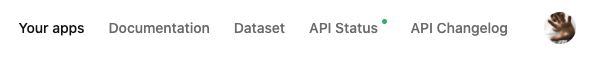
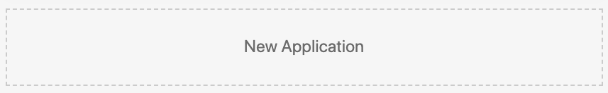
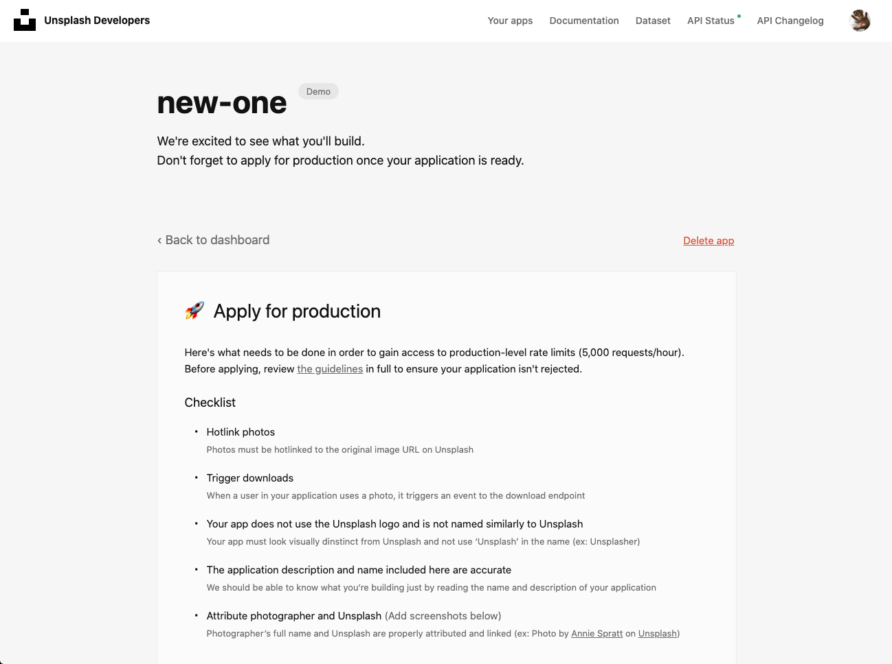
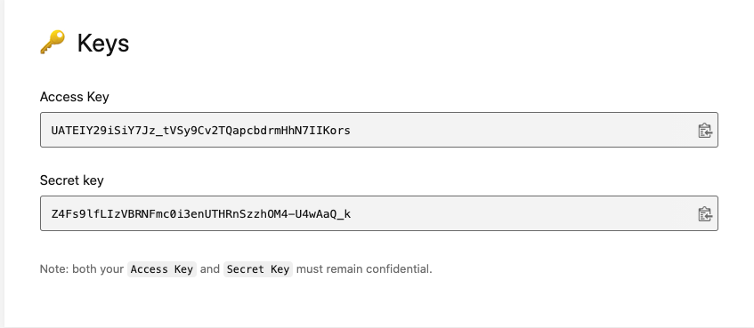
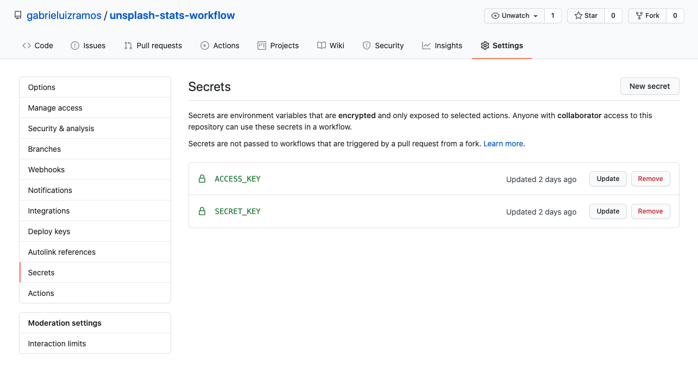

# Unsplash Stats Workflow
GitHub action to add your Unsplash stats


## How to use

### Comment Section
At your repository, add the following section to your `README.md` file: `<!-- UNSPLASH-STATS:START --><!-- UNSPLASH-STATS:END -->`. You can give any title and add anything before or after it, just like:

```markdown
# Unsplash Stats
<!-- UNSPLASH-STATS:START -->
<!-- UNSPLASH-STATS:END -->
```

The workflow will replace the comment with your Unsplash.

### Setup
- Create a `.github` folder and create a `workflows` folder inside of it, in case it doesn't exists.
- Create a new workflow file (named something like `unsplash-stats-workflow.yml`, in case it doesn't exists) with the following content:
```yml
jobs:
  unsplash_stats_job:
    runs-on: ubuntu-latest
    name: Updates Unsplash stats and blog posts

    steps:
    - name: Checkout
      uses: actions/checkout@v2

    # Collect and update markdown with Unsplash stats
    - name: Gathering Unsplash stats
      uses: gabrieluizramos/unsplash-stats-workflow@master
      with:
        username: gabrieluizramos # your unsplash username
        ACCESS_KEY: ${{ secrets.ACCESS_KEY }} # your unsplash ACCESS_KEY
        SECRET_KEY: ${{ secrets.SECRET_KEY }} # your unsplash SECRET_KEY
```

### Options
You'll have to set some options values in order to properly run the action.

| Option name     | Description                      | Where to define | Required | Default                              |
|-----------------|----------------------------------|-----------------|----------|--------------------------------------|
| file            | Your README file path            | Workflow file   | false    | `./README.md`                        |
| template        | Stats data template (table/list) | Workflow file   | false    | `list`                               |
| username        | Your Unsplash's username         | Workflow file   | true     |                                      |
| ACCESS_KEY      | Your Unsplash app's access key   | Github Secrets  | true     |                                      |
| SECRET_KEY      | Your Unsplash app's secret key   | Github Secrets  | true     |                                      |
| github_token    | GitHub token with Repo Scope     | Workflow file   | false    | ${{ github.token }}                  |
| committer_user  | Customize committer user         | Workflow file   | false    | `unsplash-stats-bot`                 |
| committer_email | Customize committer email        | Workflow file   | false    | `unsplash-stat-bots@example.com`     |
| commit_message  | Customize commit message         | Workflow file   | false    | `Updated with latest Unsplash Stats` |

For security reasons these keys (both `ACCESS_KEY` and `SECRET_KEY`) should be kept under the Github Secrets and should not be passed directly into the created workflow file. The only information you should provide at your workflow is your `username`.

You can also follow the guide below as a walk-through the process of creating/adding your keys.

#### Creating and adding your Unsplash keys to the workflow
You'll need some keys to access the Unsplash API. These values can be found at the [Unsplash Developers](https://unsplash.com/developers). You can also follow the steps below:

- Access [Unsplash Developers](https://unsplash.com/developers): 
- Click on `your apps` menu at the top right corner: 
- Click on the `new application`: 
- Fill the application information form and read the terms
- Now you'll be redirected to your app page: 
- Scroll down to copy your keys (access and secret): 
- Now go to your Github Repo `Settings` and click on the `Secrets` menu
- And just add the `ACCESS_KEY` and `SECRET_KEY` at your repo's secret: 

---

## Examples
- [My Github profile](https://github.com/gabrieluizramos/)
